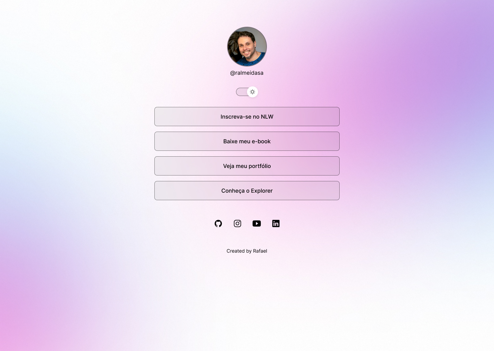

# Linktree-dev

<h1 align="center"> Linktree-dev </h1>

A linktree model created during a Rocketseat course

  <a href="#-tecnologias">Technologies</a>&nbsp;&nbsp;&nbsp;|&nbsp;&nbsp;&nbsp;
  <a href="#-projeto">Project</a>&nbsp;&nbsp;&nbsp;|&nbsp;&nbsp;&nbsp;
  <a href="#-layout">Layout</a>&nbsp;&nbsp;&nbsp;|&nbsp;&nbsp;&nbsp;
  <a href="#memo-licença">License</a>

  

 

  
  

## 🚀 Technologies

This project was developed with the following technologies:

- HTML and CSS
- JavaScript
- Git and Github
- Figma

## 💻 Project

Linktree-dev is a link aggregator to use as a business card.

## :memo: License

This project is under MIT license.

---
